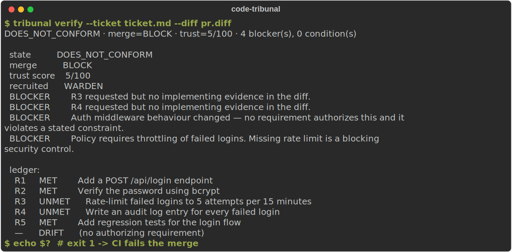
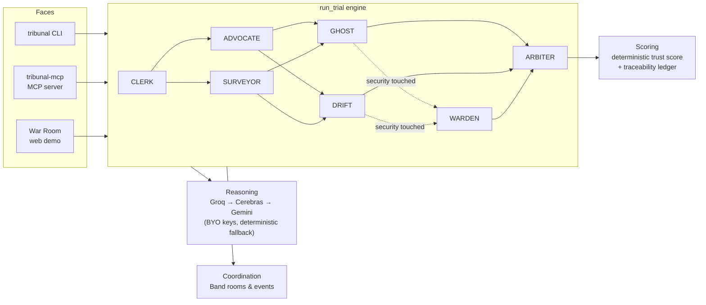

# Code Tribunal

**Did the AI build what you actually asked for?**

[](https://github.com/arun3676/code-tribunal/actions/workflows/ci.yml)
[](https://www.python.org/downloads/)
[](LICENSE)

Code Tribunal is an intent-conformance review engine for AI-generated code. Instead of asking one model whether a diff looks correct, Tribunal reconciles the **original ticket** against the **actual implementation** and returns a merge verdict, a 0–100 trust score, and a traceability ledger.



It ships three ways:

- **CLI** — `tribunal verify` in any terminal or CI pipeline (exit `0` = APPROVE, `1` = BLOCK).
- **MCP server** — drop it into Claude Code, Codex, or Cursor so your coding agent can self-check a diff before a human ever sees it.
- **Web demo** — a live War Room that shows the agents deliberating: [code-council.vercel.app](https://code-council.vercel.app).

A CLERK agent opens the case. ADVOCATE extracts requirements. SURVEYOR inspects the diff. GHOST finds requested work that is missing. DRIFT finds unrequested scope changes. WARDEN is recruited for security-sensitive changes. ARBITER produces the verdict.

**Live demo:** [code-council.vercel.app](https://code-council.vercel.app) — landing at `/`, live Tribunal at [`/tribunal`](https://code-council.vercel.app/tribunal), Code Council editor at [`/council`](https://code-council.vercel.app/council).

---

## Problem

AI coding agents produce large diffs quickly. Standard PR review asks *"is this code correct?"* Tribunal asks *"did the AI build what you actually asked for?"* — reconciling the ticket/spec against the diff before merge.

## How Tribunal works

1. Load a **docket** (ticket + diff + touched files/domains).
2. **CLERK** opens the room and routes `@mention` handoffs.
3. **ADVOCATE** extracts requirements; **SURVEYOR** inspects implementation.
4. **GHOST** finds **negative space** (requested but missing work).
5. **DRIFT** finds **scope creep** (unauthorized changes).
6. **WARDEN** is recruited mid-trial when auth/security is touched.
7. **ARBITER** issues verdict, trust score (0–100), merge decision, and traceability ledger.

## Architecture

Three decoupled layers — swapping any one never touches the others:

- **Reasoning** — the agents think on free, open models (Groq → Cerebras → Gemini fallback chain). Bring your own API keys; the chain skips any provider you haven't configured and falls back to deterministic logic if none are set.
- **Coordination** — Band runs the room (rooms, participants, `@mention` handoffs, structured events, mid-trial recruitment).
- **Scoring** — the trust score and traceability ledger are computed by deterministic, explainable math.



## Agent roster

| Agent | Role | Reasoning | Coordination |
|-------|------|-----------|--------------|
| CLERK | Orchestrator | — | Band |
| ADVOCATE | Intent witness | Groq | Band |
| SURVEYOR | Implementation witness | Groq | Band |
| GHOST | Omission auditor | Groq | Band |
| DRIFT | Scope auditor | Cerebras | Band |
| WARDEN | Security witness | Groq | Band (recruited) |
| ARBITER | Judge | Groq + deterministic scoring | Band |

### Model lineup (all free tiers)

| Provider | Models | Override env |
|----------|--------|--------------|
| Groq (default) | `llama-3.3-70b-versatile` (default) · `openai/gpt-oss-120b` · `meta-llama/llama-4-scout-17b-16e-instruct` (Llama 4 Scout) | `GROQ_MODEL` |
| Cerebras | `zai-glm-4.7` | `CEREBRAS_MODEL` |
| Gemini | `gemini-3.5-flash` | `GEMINI_MODEL` |

Fallback chain order is `TRIBUNAL_LLM_PROVIDERS=groq,cerebras,gemini`.

## Install (CLI / MCP)

> **Not on PyPI yet.** The `code-tribunal` package is release-ready (v0.3.0) but not
> published, so install straight from this repo with [`uv`](https://docs.astral.sh/uv/) —
> no clone needed. Once it's on PyPI, `--from code-tribunal` replaces the git URL
> everywhere below.

```bash
# CLI, no install
uvx --from "git+https://github.com/arun3676/code-tribunal.git#subdirectory=apps/api" tribunal --help

# or install it properly
pip install "git+https://github.com/arun3676/code-tribunal.git#subdirectory=apps/api"
```

**Claude Code / Cursor** (`mcpServers` config) — bring your own key in the `env` block:

```jsonc
{
  "mcpServers": {
    "tribunal": {
      "command": "uvx",
      "args": [
        "--from",
        "git+https://github.com/arun3676/code-tribunal.git#subdirectory=apps/api",
        "tribunal-mcp"
      ],
      "env": { "GROQ_API_KEY": "your-key-here" }
    }
  }
}
```

**Codex** (`~/.codex/config.toml`):

```toml
[mcp_servers.tribunal]
command = "uvx"
args = ["--from", "git+https://github.com/arun3676/code-tribunal.git#subdirectory=apps/api", "tribunal-mcp"]
env = { GROQ_API_KEY = "your-key-here" }
```

(Or `codex mcp add` to register it interactively.)

**CLI** — gate a PR in CI (exit code `0` = APPROVE, `1` = BLOCK):

```bash
tribunal verify --ticket ticket.md --diff change.diff
```

MCP tools exposed: `verify_intent_conformance` (full court), `ghost_check` (fast omission pre-check), `drift_check` (fast scope-drift pre-check).

### Bring your own keys (all free)

Tribunal is BYO-key across three free-tier providers — any **one** key is enough. The fallback chain skips providers without keys, and with zero keys the deterministic engine still runs (works offline, still useful).

- **Groq** — [console.groq.com](https://console.groq.com)
- **Cerebras** — [cloud.cerebras.ai](https://cloud.cerebras.ai)
- **Gemini** — [aistudio.google.com](https://aistudio.google.com)

Bake a key into the MCP block (`--key` is an alias for `--groq-key`):

```bash
tribunal init claude --groq-key gsk_...
```

`tribunal init` emits the post-PyPI form (`--from code-tribunal`). Until the package is
published, swap that for the git URL above in the block it prints.

Multi-provider, with the fallback chain and a model override:

```bash
tribunal init claude \
  --groq-key gsk_... --cerebras-key csk-... --gemini-key AIza... \
  --providers groq,cerebras,gemini \
  --groq-model llama-3.3-70b-versatile
```

Then verify your setup — `tribunal doctor` reports KEY SET/MISSING per provider plus a live 1-token PASS/FAIL (it never prints keys; exit `0` if at least one provider works):

```bash
tribunal doctor          # add --json for machines, --offline to skip live calls
```

### Coding agents (OpenClaw · Hermes · …)

Both [OpenClaw](https://docs.openclaw.ai/) and [Hermes](https://hermes-agent.nousresearch.com/docs/) are MCP clients, so the same server wires straight in. Generate the right block for any agent:

```bash
tribunal init openclaw   # ~/.openclaw/openclaw.json
tribunal init hermes     # ~/.hermes/config.yaml (+ a bundled Open Skill)
tribunal init claude     # mcpServers JSON
```

Every emitter accepts the BYO-key flags above (`--groq-key` / `--cerebras-key` / `--gemini-key` / `--providers` / `--*-model`) plus `--write` to persist to the agent's config file.

Per-agent guides, sample configs, and the Hermes Open Skill live in [`integrations/`](integrations/).

## Band coordination

Tribunal uses Band as the active coordination layer:

- CLERK creates a Band room.
- Agents are recruited as participants.
- Directed `@mention` messages trigger handoffs.
- Structured Events record requirements, findings, omissions, drift, constraints, and verdicts.
- WARDEN is recruited mid-trial when security-sensitive code is detected.

Set `BAND_ENABLED=true`, `BAND_STRICT=true`, and agent UUIDs for live mirroring. Run `python scripts/verify_band_trial.py` before deploy.

## Demo cases

**auth-login-001** (hero case):

- Ticket requests secure login: endpoint, bcrypt, rate limiting, audit log, tests, no auth middleware change.
- Diff implements login + bcrypt + audit + tests but **omits rate limiting** (GHOST / R3).
- Diff **changes auth middleware** without authorization (DRIFT).
- WARDEN recruited → **DOES_NOT_CONFORM**, Trust Score 5/100, **BLOCK**.

**health-check-002** — clean pass case. **payment-refund-003** — heavy BLOCK. **user-profile-004** — clean APPROVE.

## Local run (web demo)

```bash
git clone https://github.com/arun3676/code-tribunal.git
cd code-tribunal
cp .env.example .env    # add LLM (Groq/Cerebras/Gemini) + Band keys
python scripts/verify_all_keys.py     # key smoke test (never prints secrets)
python scripts/verify_band_trial.py   # Band smoke test
docker compose up --build
```

Open [http://localhost:3000/tribunal](http://localhost:3000/tribunal) · API [http://localhost:8000/health](http://localhost:8000/health)

```bash
curl -N -X POST http://localhost:8000/tribunal/run \
  -H "Content-Type: application/json" \
  -d '{"fixture_id":"auth-login-001"}'
```

## Other modes (web demo)

The landing page lives at `/`, the live Tribunal at `/tribunal`, and the Code Council editor at `/council`:

| Mode | Route | Description |
|------|-------|-------------|
| Solo | `/council` | Single-model code analysis |
| Council | `/council` | Multi-model consensus |
| Static scan | `/council` | Security + performance rules |
| Multimodal | `/council` | Vision model upload |

## Deployment

- **API:** `apps/api` on Railway — see [`DEPLOYMENT.md`](DEPLOYMENT.md)
- **Web:** `apps/web` on Vercel — set `NEXT_PUBLIC_API_URL`

## License

MIT — see [LICENSE](LICENSE).
